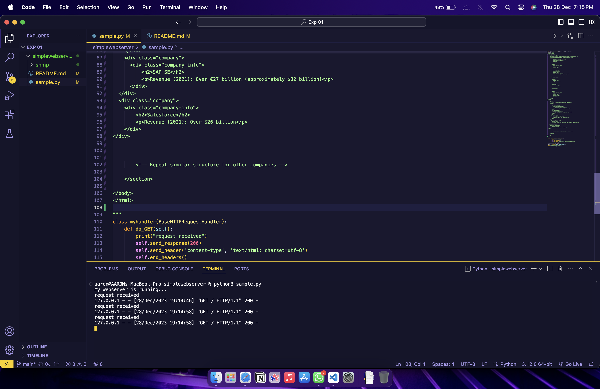
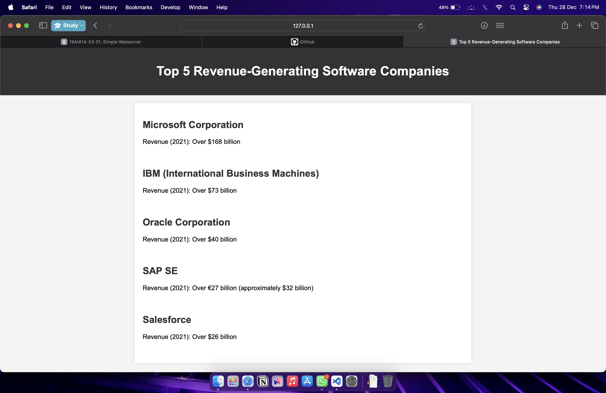

# EX01 Developing a Simple Webserver
## NAME: H. AARON
## Reference No: 23012368
## AIM:
To develop a simple webserver to serve html pages.

## DESIGN STEPS:
### Step 1: 
HTML content creation.

### Step 2:
Design of webserver workflow.

### Step 3:
Implementation using Python code.

### Step 4:
Serving the HTML pages.

### Step 5:
Testing the webserver.

## PROGRAM:
```
from http.server import HTTPServer, BaseHTTPRequestHandler
content = """
<!DOCTYPE html>
<html lang="en">
<head>
    <meta charset="UTF-8">
    <meta name="viewport" content="width=device-width, initial-scale=1.0">
    <title>Top 5 Revenue-Generating Software Companies</title>
    <style>
        body {
            font-family: 'Arial', sans-serif;
            background-color: #f4f4f4;
            margin: 0;
            padding: 0;
        }

        header {
            background-color: #333;
            color: white;
            text-align: center;
            padding: 20px;
        }

        section {
            max-width: 800px;
            margin: 20px auto;
            padding: 20px;
            background-color: white;
            box-shadow: 0 0 10px rgba(0, 0, 0, 0.1);
        }

        h2 {
            color: #333;
        }

        .company {
            display: flex;
            align-items: center;
            margin-bottom: 20px;
        }

        .company img {
            max-width: 80px;
            margin-right: 20px;
        }

        .company-info {
            flex: 1;
        }

        footer {
            background-color: #333;
            color: white;
            text-align: center;
            padding: 10px;
            position: fixed;
            bottom: 0;
            width: 100%;
        }
    </style>
</head>
<body>

    <header>
        <h1>Top 5 Revenue-Generating Software Companies</h1>
    </header>

    <section>
        <div class="company">
            <div class="company-info">
                <h2>Microsoft Corporation</h2>
                <p>Revenue (2021): Over $168 billion</p>
            </div>
        </div>
        <div class="company">
          <div class="company-info">
              <h2>IBM (International Business Machines)</h2>
              <p>Revenue (2021): Over $73 billion</p>
          </div>
      </div>
      <div class="company">
        <div class="company-info">
            <h2>Oracle Corporation</h2>
            <p>Revenue (2021): Over $40 billion</p>
        </div>
    </div>
    <div class="company">
      <div class="company-info">
          <h2>SAP SE</h2>
          <p>Revenue (2021): Over €27 billion (approximately $32 billion)</p>
      </div>
  </div>
  <div class="company">
    <div class="company-info">
        <h2>Salesforce</h2>
        <p>Revenue (2021): Over $26 billion</p>
    </div>
</div>

    </section>

</body>
</html>

"""
class myhandler(BaseHTTPRequestHandler):
    def do_GET(self):
        print("request received")
        self.send_response(200)
        self.send_header('content-type', 'text/html; charset=utf-8')
        self.end_headers()
        self.wfile.write(content.encode())
server_address = ('',8000)
httpd = HTTPServer(server_address,myhandler)
print("my webserver is running...")
httpd.serve_forever()
```
## OUTPUT:


<br/>
## RESULT:
The program for implementing simple webserver is executed successfully.
